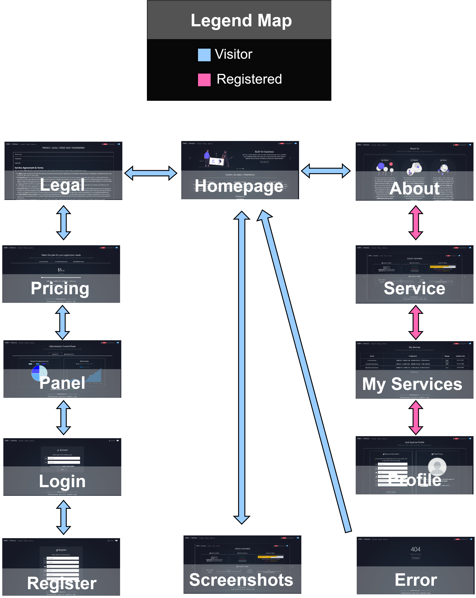

# DAW Host Services

## Context

This project is an assignment for the _Web Application Development_ subject in the
Software Engineering Degree, at _University King Juan Carlos_, Spain (2020/2021).

## Logo


## Table of Contents

**Phases 0 & 1**.
* [Introduction](#introduction)
  * [Team Members](#members)  
* [Starting Decisions](#start)
  * [Theme](#theme)   
  * [Entities](#entities)  
  * [Roles and Permissions](#roles-and-perms)  
  * [Images](#images)  
  * [Charts](#charts)   
  * [Third Party Technology](#third-tech)
  * [Advanced algorithm](#algorithm)
* [Visuals](#visuals)
  * [Screenshots](#screenshots)
  * [Navigation Diagram](#navigation)   
**Phase 2**    
* [Installation](#phase-2)   
  * [Linux](#linux-install-linux-2)   
  * [Windows](#linux-install-win-2)   

# Introduction <a name="introduction"></a>

The main objective of this application is to simulate, as closely as possible, a hosting provider.
A lot of different kinds of products will be available for rental, the products will be based on
multiple elegible configurations (_hardware and network specifications_). Each package rental will
have associated an expiration time (_before package usage time expires you need to renew it_).

## Team Members <a name="members"></a>

| Full Name | Email | GitHub Profile |
| ------------- | ------------- | ------------- |
| Serghei Sergheev | s.sergheev.2018@alumnos.urjc.es | [sergheevdev](https://github.com/sergheevdev) |
| Allan Robert Cobb Bellido | ar.cobb.2018@alumnos.urjc.es | [Allanmaster](https://github.com/Allanmaster) |
| Álvaro Noguerales Ramos | a.noguerales.2016@alumnos.urjc.es | [Anogue](https://github.com/Anogue) |
| Alberto Mautone | a.mautone.2020@alumnos.urjc.es | [albehma](https://github.com/albehma) |
| Alejandro José Rodriguez Montero | aj.rodriguez.2018@alumnos.urjc.es | [Alexrguez9](https://github.com/Alexrguez9) |

All the organisation will be done using a _Trello_ board.

## Phases 0 & 1

# Starting Decisions <a name="start"></a>

### Theme <a name="theme"></a>

- The theme of the application a _marketplace_, to be more concise a server reseller.

### Entities <a name="entities"></a>

- **User**: a user will be the entity in charge of storing all kinds of information related to authentication.
- **Role**: a role or authority, holds a set of permissions that will allow a user perform certain actions.
- **Product**: is an entity that contains all the information related to the product (i.e. price, category and specs)
- **Order**: represents a product rental action and contains order attributes (i.e. rental date, expiration
  date, etc)
- **OneTimeDiscount**: will represent a one time discount sale, this is non-recurrent one time applied discount.
- **AccumulativeDiscount**: it will represent a discount as a reward for subsequent purchases in a concrete
  timespan and will contain a configuration (i.e. after 5 puchasing packages of a category, the next packages
  of the same kind, will be given an X% amount of discount)

### Roles and permissions <a name="roles-and-perms"></a>

The previously mentioned _Role_ entity, will be responsible of holding all the permissions, a permission will
represent an additional action which the user can perform (i.e. see a page, perform special action, etc).

- **Visitor**: can read generic information about the business (i.e. homepage, about us, pricing).
- **Client**: can perform client tasks (i.e. order or cancel products, change profile information, check hired services).
- **Administrator**: can effectuate moderative and administrative actions (i.e. disable accounts, check statistics, modify clients).

### Images <a name="images"></a>

- Each client will have its own _profile_ with an _avatar_.
- The website will be plenty of _icons_ to improve accesibility.
- The _administrator_ will be able to see client profile pictures when managing clients from panel.

### Charts <a name="charts"></a>

- The **administrator** control panel, will contain the weekly purchased services _pie chart_,
  weekly sales _time series chart_, and the total accumulated capital statistic.

### Third-party Additional Technology <a name="third-tech"></a>

- [Gmail API](https://developers.google.com/gmail/api): we will be using the Gmail API with Spring Email
  to send registration welcome messages and order receipts and server information to the clients.
- [Open PDF](https://github.com/LibrePDF/OpenPDF): we will also be using OpenPDF to generate PDF's for
  the product receipts in the client rented services area.

### Advanced Algorithm <a name="algorithm"></a>

We will be using two kinds of algorithms based on discounts for products:
1. Giving XX% non-recurrent discount on inauguration (or special events), this algorithm will be configurable.
2. Acummulative purchases, every X services you rent in a concrete timespan, given an additional XX% discount
   on subsequent purchases, all percentages also configurable.

# Visuals <a name="visuals"></a>

### Screenshots <a name="screenshots"></a>

#### Visitor View

- **Homepage**: main page when you enter the application, it contains basic information.


- **Pricing**: specifies the price for each package configuration available to purchase.


- **About us**: describes the enterprise, its origins, present, and future.


- **Legal**: contains all legal, privacy & security, terms of use and trademarks.


- **FAQ**: stands for frequently asked questions and contains the most asked questions about our services.


- **Screenshots**: contains an overview of the user services panel and other interface stuff.


- **Login**: page to perform the authentication and log-in into our account.


- **Register**: here we register providing our personal data and creating an account to become clients.


- **Error**: the page which is shown when the provided page does not exist or you're unauthorized:


#### Client View

- **My Services**: a page where you can see a list of your recently purchased services.


- **Profile**: allows you to modify your personal information details.


- **Service**: where you manage your concretely selected service from the previous page.


#### Admin View

- **Panel > Statistics**: chart section of the panel where you can easily track your sales.


- **Panel > Manage Clients**: client management section of the panel where you can disable,
  enable and check client profile information.


- **Panel > One Time Discount**: one time discount sale management.


- **Panel > Accumulative Discount**: accumulative or recurrent sale management.


### Navigation Diagram <a name="navigation"></a>



## Phase 2 <a name="phase-2"></a>

Fully working traditional MVC application with all the backend implemented.

### Installation instructions for Linux (Ubuntu/Debian based Systems) <a name="linux-install-linux-2"></a>

Copy and execute with **sudo** this script:

```bash
#!/bin/bash
git clone https://github.com/CodeURJC-DAW-2020-21/webapp11
rm -rf $HOME/webapp11
cd $HOME/webapp11/backend
chmod +x install_and_run.sh
./install_and_run.sh
```

### Installation instructions for Windows <a name="linux-install-win-2"></a>

1. Download and install [Docker Desktop](https://docs.docker.com/docker-for-windows)
2. Download and install [Maven](https://maven.apache.org/guides/getting-started/windows-prerequisites.html)
3. Download and install [Git](https://git-scm.com/)
4. Clone the application repository with Git: 

```cmd
git clone https://github.com/CodeURJC-DAW-2020-21/webapp11
```

5. Inside the cloned repository folder, go inside the "backend" folder.
6. Execute the maven command to compile the code:

```cmd
mvn clean install
```

7. Inside the "backend" folder go inside the "target" folder.
8. Copy the "marketplace-0.0.1-SNAPSHOT.jar" file to the "docker" folder.
9. Inside the "docker" folder, change the "_marketplace-0.0.1-SNAPSHOT.jar_" file name to "_marketplace.jar_"
10. Execute the docker image creation command:

```cmd
docker build -t daw-team-11/marketplace .
```

11. Run the docker compose file:

```cmd
docker-compose up -d
```


