# DAW Host Services

## Context

This project is an assignment for the _Web Application Development_ subject in the
Software Engineering Degree, at _University King Juan Carlos_, Spain (2020/2021).

## Logo

## Description

The main objective of this application is to simulate, as closely as possible, a hosting provider.
A lot of different kinds of products will be available for rental, the products will be based on
multiple elegible configurations (_hardware and network specifications_). Each package rental will
have associated an expiration time (_when package usage time expires you need to renew it_).

## Team Members

| Full Name | Email | GitHub Profile |
| ------------- | ------------- | ------------- |
| Serghei Sergheev | s.sergheev.2018@alumnos.urjc.es | [sergheevdev](https://github.com/sergheevdev) |
| Allan Robert Cobb Bellido | ar.cobb.2018@alumnos.urjc.es | [Allanmaster](https://github.com/Allanmaster) |
| Álvaro Noguerales Ramos | a.noguerales.2016@alumnos.urjc.es | [Anogue](https://github.com/Anogue) |
| Alberto Mautone | a.mautone.2020@alumnos.urjc.es | [albehma](https://github.com/albehma) |
| Alejandro José Rodriguez Montero | aj.rodriguez.2018@alumnos.urjc.es | [Alexrguez9](https://github.com/Alexrguez9) |

All the organisation will be done using a _Trello_ board.

## Phase 0

### Theme

- The theme of the application a _marketplace_, to be more concise a server reseller.

### Entities

- **User**: a user will be the entity in charge of storing all kinds of information related to authentication.
- **Role**: a role or authority, holds a set of permissions that will allow a user perform certain actions.
- **Product**: is an entity that contains all the information related to the product (i.e. price, category and specs)
- **Order**: represents a product rental action and contains order attributes (i.e. rental date, expiration
  date, etc)
- **Discount**: will represent a product sale (a.k.a. discount) for your first purchase and will contain all
  the neccesary attributes related to that sale (i.e. sale duration, discount percentage).
- **AccumulativeDiscount**: it will represent a discount as a reward for subsequent purchases in a concrete
  timespan and will contain a configuration (i.e. after 5 puchasing packages of a category, the next packages
  of the same kind, will be given an X% amount of discount)

### Roles and permissions

The previously mentioned _Role_ entity, will be responsible of holding all the permissions, a permission will
represent an additional action which the user can perform (i.e. see a page, perform special action, etc).

- **Visitor**: can read generic information about the business (i.e. homepage, about us, pricing).
- **Client**: can perform client tasks (i.e. order or cancel products, change profile information, check hired services).
- **Administrator**: can effectuate moderative and administrative actions (i.e. disable accounts, check statistics, modify clients).

### Images

- Each client will have its own _profile_ with an _avatar_ (_they will be able to change that avatar_).
- The website will be plenty of _icons_ to improve accesibility.

### Charts

- The **administrator** control panel will be plenty of charts with different kinds of statistics
  (i.e. daily purchases, accumulated earnings, etc).

### Third-party Additional Technology

- [Gmail API](https://developers.google.com/gmail/api): we will be using the Gmail API with Spring Email
  to send order receipts and server information to the clients.
- [Apache PDF Box](https://pdfbox.apache.org/): we will also be using Apache PDF Box to generate PDF's for
  the product receipts in the client rented services area.

### Advanced Algorithm

We will be using two kinds of algorithms based on discounts for products:
1. Giving XX% non-recurrent discount on inauguration (or special events), this algorithm will be configurable.
2. Incremental purchases, every X services you rent in a concrete timespan, given an additional XX% discount
   on subsequent purchases, all percentages also configurable.

### Screenshots

#### Home

The homepage is where you can take a little look and guess what is the purpose of this page. It has
a panel of images, and attractive information about the hosting provider.

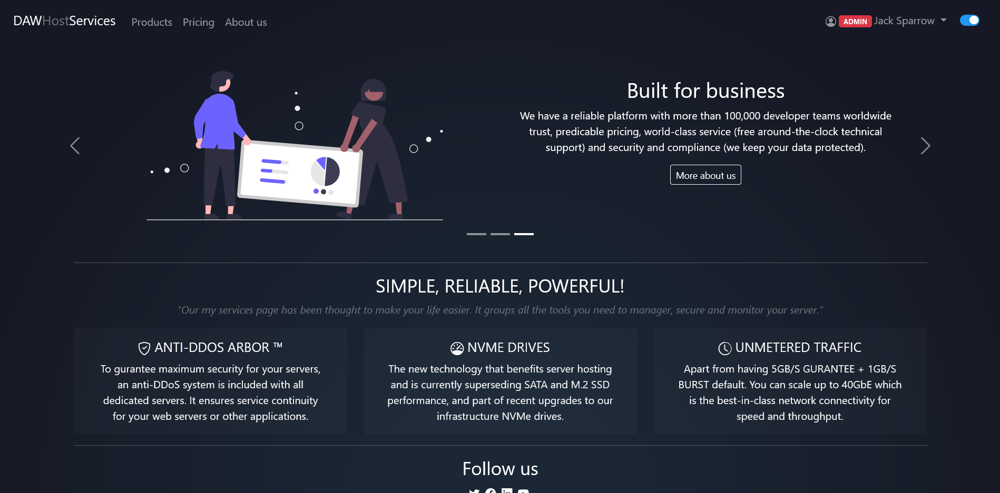

#### Pricing

In the pricing page you can check all the available packages and its configurations to purchase, we
have a lot of server categories available to suit your needs.

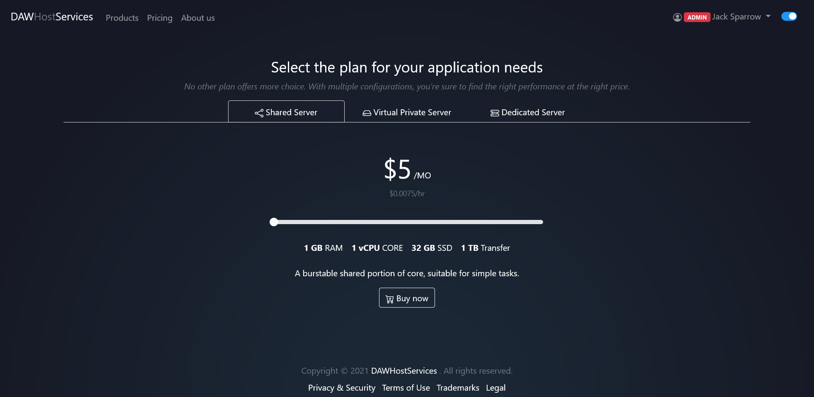

#### About

Inside the about page you can find three different sections that describe the story behind the company
starting with the origins, then talking about the present and finally describing how we see the future.

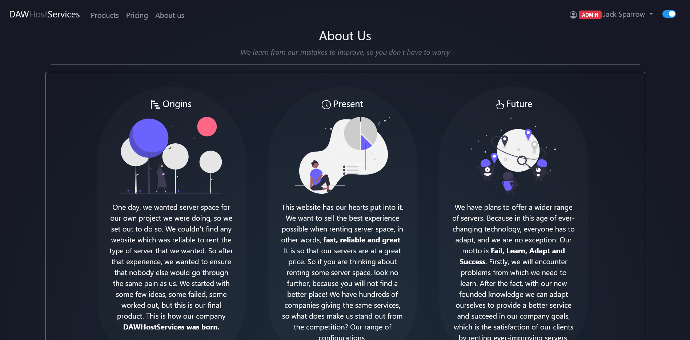

#### Screenshots

The content of this page is a mere visualization of the "My Services" page and the "Service Overview"
to show the client the panel which they will have available in case of purchasing any service.

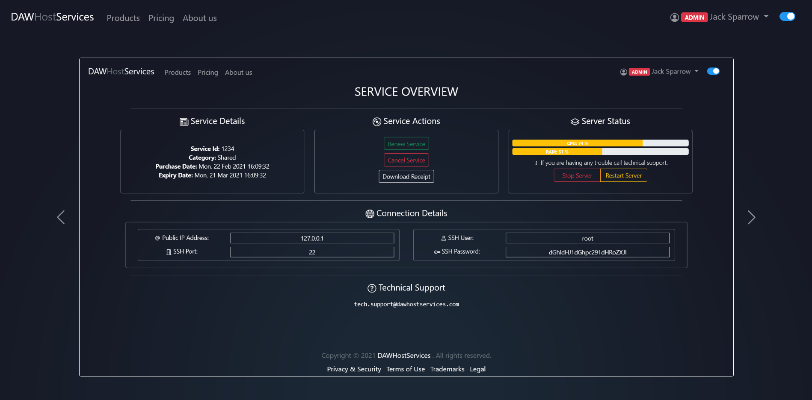

#### Login

If you want to purchase services and manage your profile you must login-in, and for that you may need
to create an account on this great website.

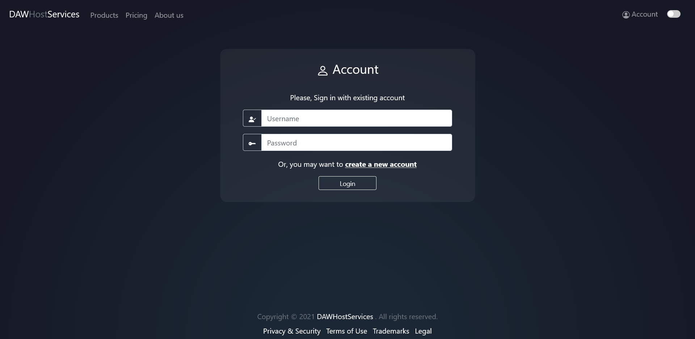

#### Register

As previously specified, to purchase services you need an account, this is the page where you can register
and create a new account by providing your information and submitting it.

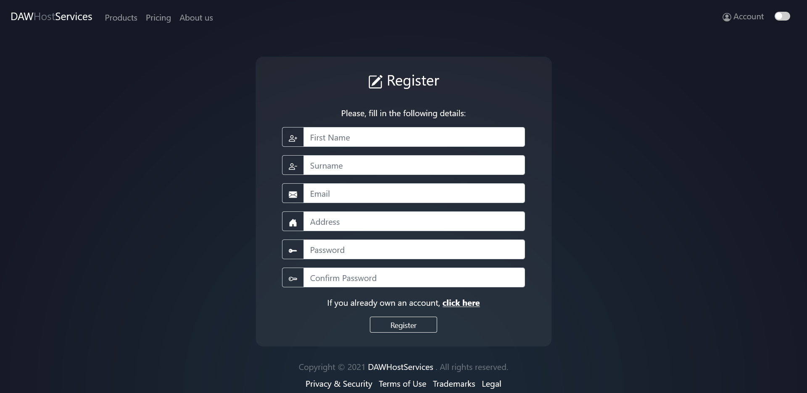

#### Legal

Before purchasing any services we recommend you to check the legal page where you have all kinds of legal,
privacy and security information about us.

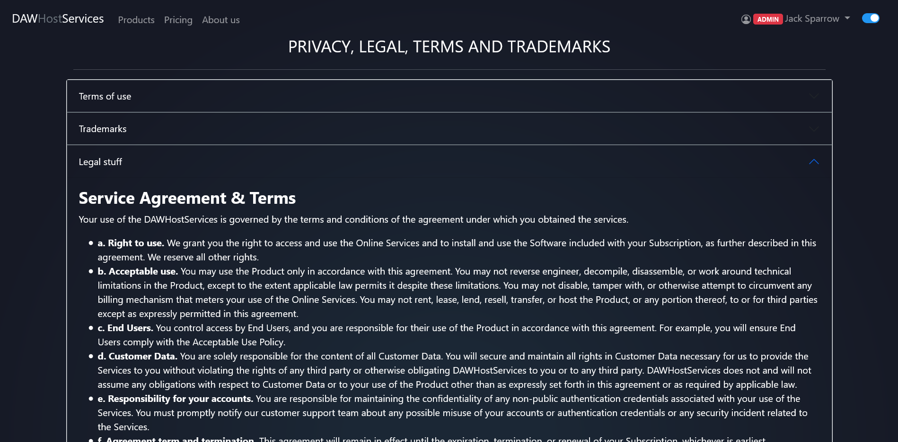

#### Error

If you try to access a page that does not exist in our website you may get this error.

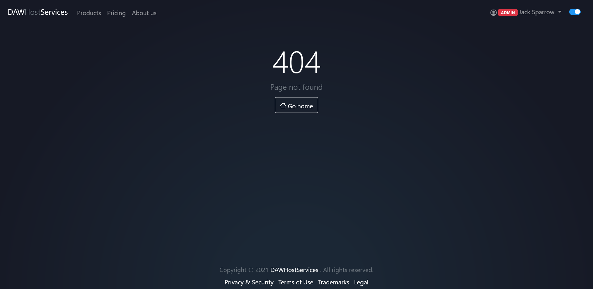

#### Profile

If you want, you may change your avatar, your billing address and other serveral details
in the profile page.

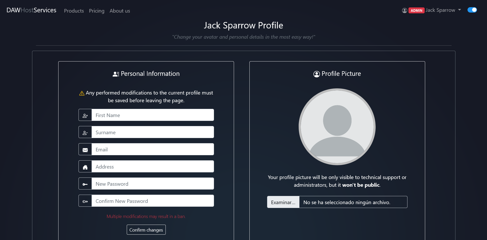

#### My Services

When you purchase a service, after completing the payment, you will be redirected to
the "My Services" page where you will be able to manage all your services and find
all kinds of information associated to them.

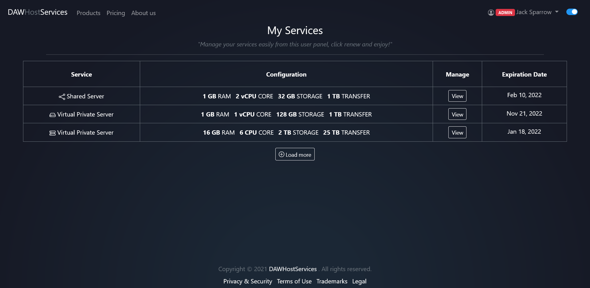

#### Service Overview

This page provides you with information about the selected service in the previously
mentioned "My Services" page, and allows you to manage that concrete purchased service.

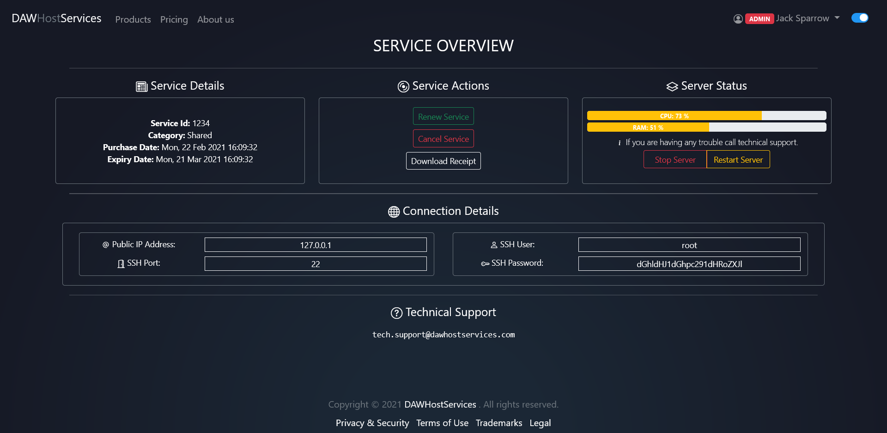

#### Administrator Panel

In this page, the administrator will be able to analyze and visualize different statistics
about the purchases and accumulated capital.

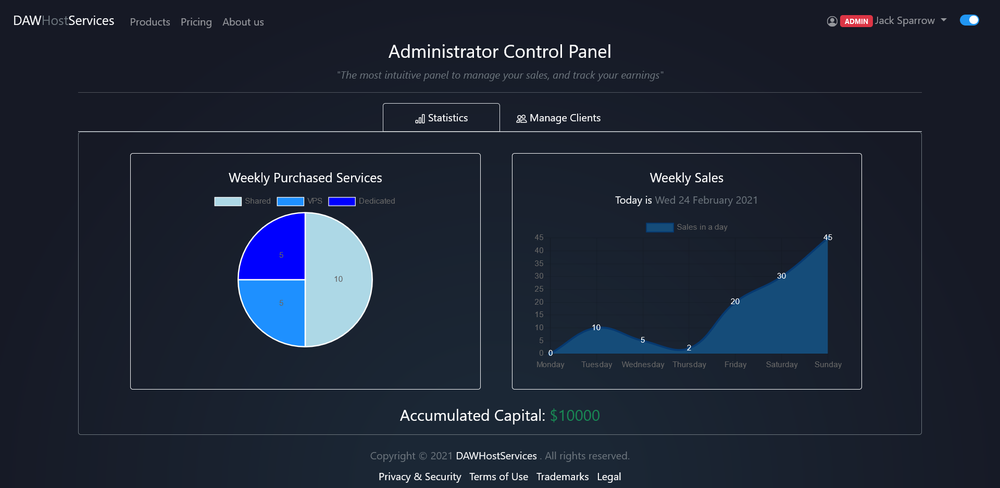

In the next tab the admin will also be able
to manage client account and modify their details as well as disable or enable their accounts.

### Navigation Diagram

