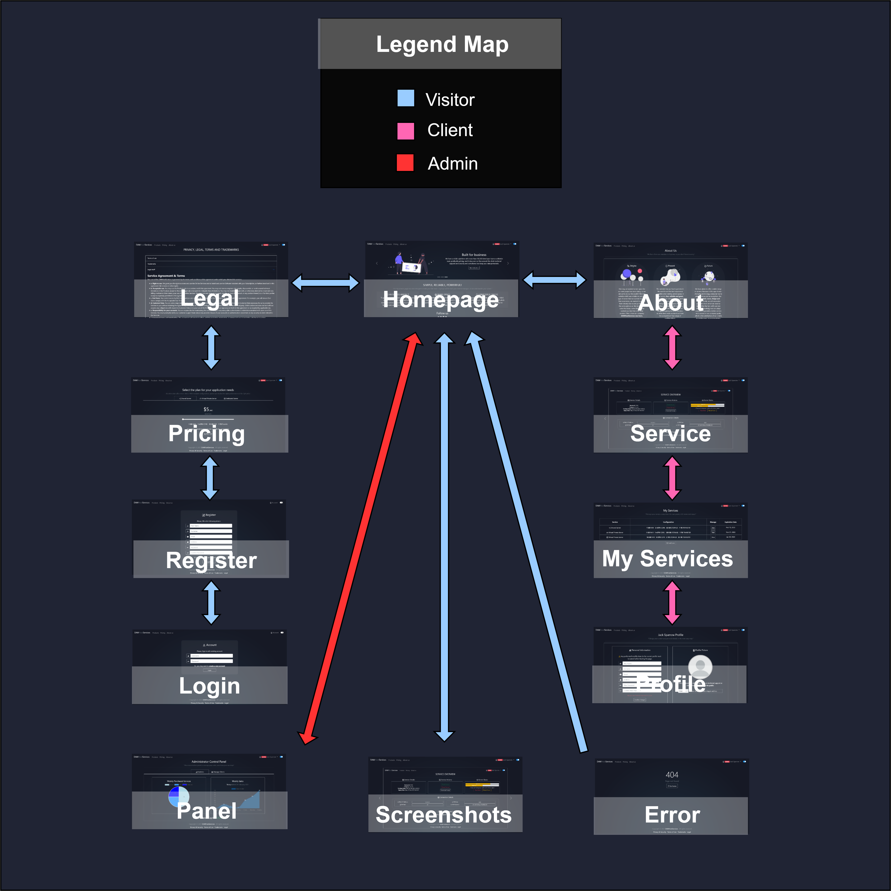

# DAW Host Services

## Context

This project is an assignment for the _Web Application Development_ subject in the
Software Engineering Degree, at _University King Juan Carlos_, Spain (2020/2021).

## Logo

## Description

The main objective of this application is to simulate, as closely as possible, a hosting provider.
A lot of different kinds of products will be available for rental, the products will be based on
multiple elegible configurations (_hardware and network specifications_). Each package rental will
have associated an expiration time (_when package usage time expires you need to renew it_).

## Team Members

| Full Name | Email | GitHub Profile |
| ------------- | ------------- | ------------- |
| Serghei Sergheev | s.sergheev.2018@alumnos.urjc.es | [sergheevdev](https://github.com/sergheevdev) |
| Allan Robert Cobb Bellido | ar.cobb.2018@alumnos.urjc.es | [Allanmaster](https://github.com/Allanmaster) |
| Álvaro Noguerales Ramos | a.noguerales.2016@alumnos.urjc.es | [Anogue](https://github.com/Anogue) |
| Alberto Mautone | a.mautone.2020@alumnos.urjc.es | [albehma](https://github.com/albehma) |
| Alejandro José Rodriguez Montero | aj.rodriguez.2018@alumnos.urjc.es | [Alexrguez9](https://github.com/Alexrguez9) |

All the organisation will be done using a _Trello_ board.

## Phase 0

### Theme

- The theme of the application a _marketplace_, to be more concise a server reseller.

### Entities

- **User**: a user will be the entity in charge of storing all kinds of information related to authentication.
- **Role**: a role or authority, holds a set of permissions that will allow a user perform certain actions.
- **Product**: is an entity that contains all the information related to the product (i.e. price, category and specs)
- **Order**: represents a product rental action and contains order attributes (i.e. rental date, expiration
  date, etc)
- **Discount**: will represent a product sale (a.k.a. discount) for your first purchase and will contain all
  the neccesary attributes related to that sale (i.e. sale duration, discount percentage).
- **AccumulativeDiscount**: it will represent a discount as a reward for subsequent purchases in a concrete
  timespan and will contain a configuration (i.e. after 5 puchasing packages of a category, the next packages
  of the same kind, will be given an X% amount of discount)

### Roles and permissions

The previously mentioned _Role_ entity, will be responsible of holding all the permissions, a permission will
represent an additional action which the user can perform (i.e. see a page, perform special action, etc).

- **Visitor**: can read generic information about the business (i.e. homepage, about us, pricing).
- **Client**: can perform client tasks (i.e. order or cancel products, change profile information, check hired services).
- **Administrator**: can effectuate moderative and administrative actions (i.e. disable accounts, check statistics, modify clients).

### Images

- Each client will have its own _profile_ with an _avatar_ (_they will be able to change that avatar_).
- The website will be plenty of _icons_ to improve accesibility.

### Charts

- The **administrator** control panel will be plenty of charts with different kinds of statistics
  (i.e. daily purchases, accumulated earnings, etc).

### Third-party Additional Technology

- [Gmail API](https://developers.google.com/gmail/api): we will be using the Gmail API with Spring Email
  to send order receipts and server information to the clients.
- [Apache PDF Box](https://pdfbox.apache.org/): we will also be using Apache PDF Box to generate PDF's for
  the product receipts in the client rented services area.

### Advanced Algorithm

We will be using two kinds of algorithms based on discounts for products:
1. Giving XX% non-recurrent discount on inauguration (or special events), this algorithm will be configurable.
2. Incremental purchases, every X services you rent in a concrete timespan, given an additional XX% discount
   on subsequent purchases, all percentages also configurable.

### Screenshots (_animated gifs_)

#### Visitor View

#### Client View

#### Admin View

### Navigation Diagram

